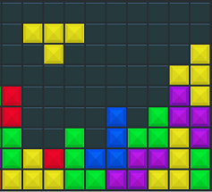
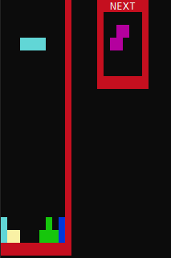

  

Tetris is a simple implementation of popular game.  

It contains 6 standart tetris figures.  
The aim in Tetris is simple; you bring down blocks from the top of the screen. 
You can move the blocks around, either left to right and/or you can rotate them. 
The blocks fall at a certain rate, but you can make them fall faster if you’re sure of your positioning. 
Your objective is to get all the blocks to fill all the empty space in a line at the bottom of the screen; 
whenever you do this, you’ll find that the blocks vanish and you get awarded some points.  

Gameplay preview:  
